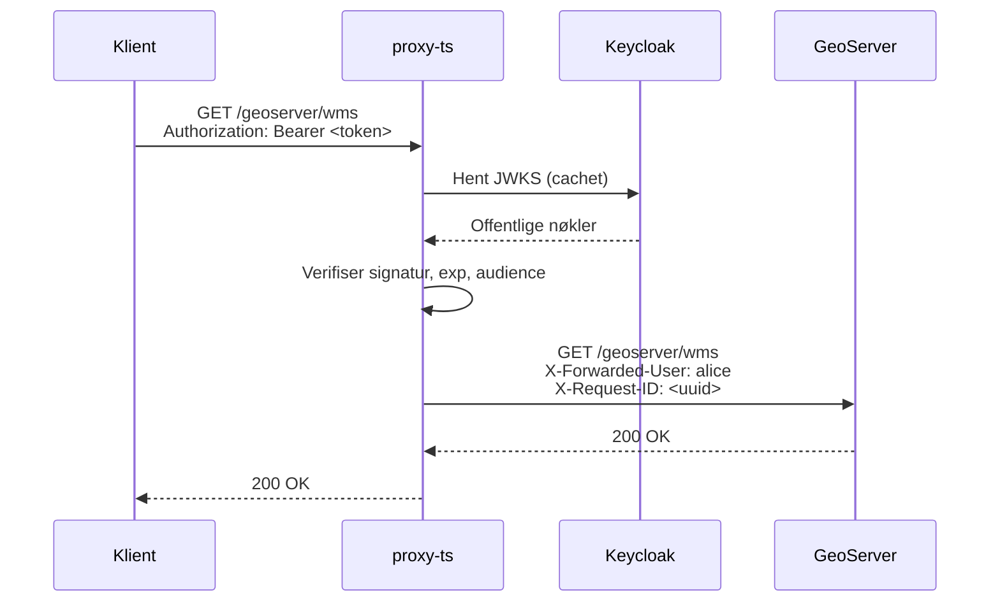
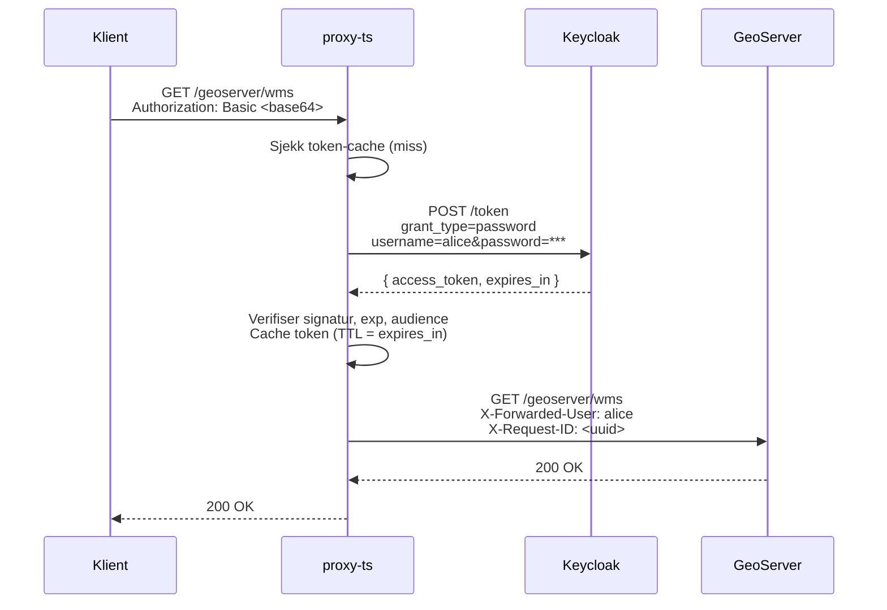

# proxy-ts

Autentiseringsproxy for GeoServer skrevet i TypeScript (Bun + Hono). Proxyen sitter foran GeoServer og krever at alle klienter er autentisert via Keycloak. Den støtter to autentiseringsmetoder: Bearer-tokens (JWT) og Basic auth.

## Autentiseringsflyt

### Bearer token

Klienten henter et JWT fra Keycloak selv (f.eks. via authorization code flow), og sender det som `Authorization: Bearer <token>`.



### Basic auth

Klienten sender brukernavn og passord som `Authorization: Basic <base64>`. Proxyen gjør en ROPC-utveksling mot Keycloak for å hente et JWT, verifiserer det, og cacher tokenet for gjenbruk.



Ved neste forespørsel med samme credentials: cache-treff → ingen ny Keycloak-forespørsel.

## Oppstrøms-headere

Proxyen rydder opp i `Authorization`-headeren og setter disse mot GeoServer:

| Header | Verdi |
|---|---|
| `X-Forwarded-User` | `preferred_username` fra tokenet, fallback til `sub` |
| `X-Request-ID` | Videresendes hvis allerede satt, ellers generert UUID |

`Authorization`-headeren **slettes** alltid — GeoServer ser aldri klient-credentials.

## Helse-endepunkt

`GET /health` proxyes direkte til GeoServer uten autentisering. Brukes av Kubernetes liveness/readiness-probes og load balancers.

## Miljøvariabler

Alle variabler er påkrevd — proxyen starter ikke uten dem.

| Variabel | Beskrivelse |
|---|---|
| `KEYCLOAK_ISSUER_URL` | Issuer-URL for Keycloak-realmet, f.eks. `https://kc.example.com/realms/matrikkel` |
| `KEYCLOAK_CLIENT_ID` | Klient-ID brukt i OIDC discovery og ROPC-forespørsler |
| `ACCEPTED_AUDIENCES` | Komma-separert liste over gyldige `aud`-verdier i JWT, f.eks. `matrikkel-geoserver` |
| `GEOSERVER_URL` | Base-URL til GeoServer, f.eks. `http://localhost:8080` |
| `PORT` | Port proxyen lytter på |

Ved oppstart gjør proxyen OIDC discovery mot `KEYCLOAK_ISSUER_URL/.well-known/openid-configuration` for å hente `token_endpoint` og `jwks_uri` automatisk.

## Kjør lokalt

```bash
bun install
bun --env-file ../.env.dev src/index.ts
```

Eller med eksplisitte variabler:

```bash
KEYCLOAK_ISSUER_URL=https://kc.example.com/realms/matrikkel \
KEYCLOAK_CLIENT_ID=matrikkel-geoserver \
ACCEPTED_AUDIENCES=matrikkel-geoserver \
GEOSERVER_URL=http://localhost:8681 \
PORT=8602 \
bun src/index.ts
```

## Test og lint

```bash
bun test          # kjør alle tester
bun run lint      # Biome linting
bun run lint:fix  # Biome linting med auto-fix
```

## Docker

```bash
docker build -t proxy-ts .
docker run -p 8602:80 \
  -e KEYCLOAK_ISSUER_URL=... \
  -e KEYCLOAK_CLIENT_ID=matrikkel-geoserver \
  -e ACCEPTED_AUDIENCES=matrikkel-geoserver \
  -e GEOSERVER_URL=http://geoserver:8080 \
  -e PORT=80 \
  proxy-ts
```